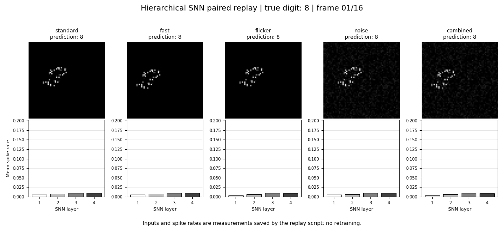

# 层级多时间尺度脉冲神经网络

[English README](README_EN.md) · [中文操作说明](docs/操作说明.md) · [English operation guide](docs/OPERATION_GUIDE.md)

本仓库只保留能够复现专利主要结果的**推理代码和证据文件**。它包含四个最佳 checkpoint、五种测试条件的确定性刺激生成、四层 ProfilePLIF 网络、在线线性探针、完整测试集推理、120 样本配对重放、证据审计、图表和软件运行视频。训练循环、优化器、SupCon 损失、训练采样器、训练 YAML 及未被这些 checkpoint 使用的扩展架构均未打包。



## 三种运行方式

| 入口 | 用途 | MNIST / SNN 运行库 | 主要输出 |
| --- | --- | --- | --- |
| `bash scripts/run_quick_demo.sh` | 从 checkpoint 和 TensorBoard 重建表格、时间常数、图和视频 | 不需要 | `outputs/audit/`、`outputs/figures/` |
| `bash scripts/run_full_replay.sh` | 对固定 120 个数字重新推理并与保存样本比较 | 需要 | `outputs/replay/` |
| `python scripts/evaluate_main_results.py` | 对四个 checkpoint 重新执行五个 10000 样本测试集 | 需要 | `outputs/inference/main_results.csv` |

快速核验只需普通 Python 环境：

```bash
python3 -m venv .venv
source .venv/bin/activate
python -m pip install -r requirements.txt
bash scripts/run_quick_demo.sh
```

成功时显示 `Quick demo PASS`。

## 推理架构

```text
[B,16,1,64,64]
  → Conv/BN/ProfilePLIF(32)  → AvgPool
  → Conv/BN/ProfilePLIF(64)  → AvgPool
  → Conv/BN/ProfilePLIF(128) → AvgPool
  → Conv/BN/ProfilePLIF(128)
  → 末4帧脉冲的空间、时间平均 → 128维表征
  → 已训练的 128→10 线性探针 → 数字类别
```

核心实现在 `src/patent_snn/`：

- `model.py`：四层 SNN、通道时间常数映射和末四步脉冲表征；
- `checkpoint.py`：严格加载模型与 probe，参数名或形状不一致时直接失败；
- `data.py`：五种测试条件和 120 样本重放所需的确定性刺激生成。

checkpoint 中仍含训练时的 projection head 和优化器状态，作为原始实验记录保留；推理代码不会实例化或调用它们。运行配置直接读取 checkpoint 内的 `cfg`，避免复制训练 YAML 造成版本漂移。

## 四种层级配置

| 配置 | 层级系数 | 名义预算 B |
| --- | --- | ---: |
| 递减 `bio` | `[0.80, 0.55, 0.35, 0.15]` | 0.271875 |
| 均匀 `equal` | `[0.522, 0.522, 0.522, 0.522]` | 0.272484 |
| 反向 `reverse` | `[0.15, 0.35, 0.55, 0.80]` | 0.271875 |
| 固定 `fixed` | `[0, 0, 0, 0]` | 0 |

均匀配置只是近似预算匹配。严格匹配所需系数约为 `0.521416`，不能用它改写已有 checkpoint 的实验设置。

## 主要结果

以下每一行的五项准确率来自该配置同一个最佳 checkpoint；checkpoint 按标准测试准确率选择。

| 配置 | 轮次 | 标准 | 未见速度 | 未见闪烁 | 未见噪声 | 联合扰动 |
| --- | ---: | ---: | ---: | ---: | ---: | ---: |
| 递减 | 62 | 96.81% | 94.59% | 95.84% | 95.70% | 93.97% |
| 均匀 | 47 | 95.20% | 92.87% | 93.65% | 94.14% | 91.84% |
| 反向 | 58 | 94.41% | 90.06% | 91.24% | 93.82% | 90.55% |
| 固定 | 69 | 89.73% | 77.82% | 84.13% | 87.87% | 80.20% |

递减配置在这五项现有单次结果中均占优。现有实验只有随机种子 0，并且使用标准测试集选模，因此不支持“统计显著”表述。

## 完整主结果推理

```bash
bash scripts/setup_full_runtime.sh
python scripts/download_mnist.py
export PYTHONPATH="$PWD/src:$PWD/vendor/spikingjelly"
python scripts/evaluate_main_results.py --device cuda:0
```

脚本先严格加载四个 checkpoint，再为每个测试条件建立确定性缓存，最后输出推理准确率及 checkpoint 记录值。五个缓存各含 10000 个 16 帧、64×64 样本，需要较长运行时间和约 13 GiB 可用磁盘。可用 `--profiles bio` 只验证递减配置。

120 样本重放更快：

```bash
bash scripts/run_full_replay.sh --device cuda:0
```

该脚本会检查标签、样本索引、预测和输入逐项一致，并对 GPU 可能引入的边界脉冲差异使用明确容差。

## 数据与证据

`data/samples/paired_replay_120.npz` 保存 120 个类别平衡测试数字在标准、快速、闪烁、噪声和联合扰动下的预测、128 维表征、四层逐帧平均脉冲率和示例输入。它是固定种子的描述性重放，不等同于五个完整测试集，也不构成层级功能的因果验证。

| 路径 | 内容 |
| --- | --- |
| `src/patent_snn/` | 主要结果所需的最小推理实现 |
| `checkpoints/` | 四个随机种子 0 的最佳 checkpoint |
| `data/tensorboard/` | 原训练记录，用于核对同轮分数 |
| `data/derived/` | 表1、时间常数及历史峰值口径数据 |
| `data/samples/` | 120 样本配对重放 |
| `scripts/` | 审计、完整评估、重放、绘图和安装入口 |
| `figures/`、`media/` | 专利证据图和软件运行视频 |
| `docs/` | 中英文操作说明与证据索引 |

## 最新实现与历史材料

- 推理数学和刺激生成取自 2026 年 7 月核对过的最新兼容实现；工作区内更早的 `plif-repo/moving_mnist` 副本未采用。
- 本包把经过验证的基础路径整理为 `src/patent_snn/`；删除的训练及扩展代码不参与四个 checkpoint 的推理。
- `data/derived/training_peak_metrics.csv` 只解释旧图的“分项峰值”口径。表1始终使用 `best_checkpoint_metrics.csv` 中的同 checkpoint 数值。
- 原专利文档含申请主体和发明人信息，未放入公开仓库；技术段落映射见[专利证据索引](docs/专利证据索引.md)。

